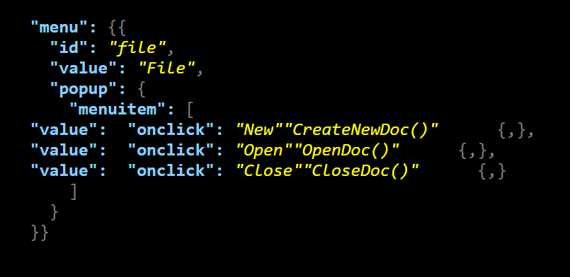
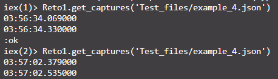

# Actividad Integradora 3.4 - Resaltador de sintaxis
## Correr el Programa

Para correr el programa, se debe estar en la consola de elixir. Se entra con el comando iex.
Ademas, se debe tener el programa cargado. Usamos el flag Reto1.exs para eso

```
iex Reto1.exs
```

Una vez dentro, el programa se corre con la siguiente funcion. Recuerden cambiar el 'input_file_here'
al archivo que quieran hacer input.

```
Reto1.get_captures(input_file_here)
```
*** Ejemplo

```
Reto1.get_captures('Test_files/example_4.json')
```
Siempre será subido al archivo output.html

## Reflexion
Este programa todavia tiene muchas mejoras. En primera, corre en un lamentable O(n<sup>^3</sup>), pues corre linea por linea,
pasando por una funcion recursiva, y cada linea corre por un Regex, que funciona de manera lineal. Aunque en archivos relativamente
pequeños, en archivos más grandes podría empezar a tener problemas más obvios.
Además, el programa no es perfecto. En el caso donde más de un valor se repita por línea, los valores tienen un orden de prioridad
y, por ende, serán agregados de manera incorrecta. Aunque en la mayoría de los casos no afecta, pues no hay múltiples llaves o 
puntuaciones por líneas, en los casos donde sí, va a fallar.
.


Si corro el programa usando example_4.json, se tarda aproximadamente 216 milisegundos. 
.


